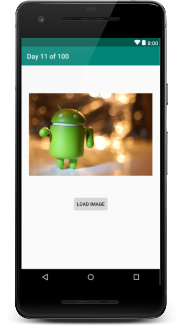

# DAY 11 CHALLENGE
Today’s android challenge is To learn how to use AsyncTask to load an image from Url.

The application is a single Activity with ImageView and Button.

Use Button click event to start loading an image in background with AsyncTask. 

## Task requirements
1. The activity will appear with "Load Image" Button and empty ImageViewer.
2. When a user click on the button the image will start loading in the background with a message show it started to loading.
3. On success loading image will appear in the ImageViewer.
4. On fail the message "Failed to loading the image" will appear.

## Hint
Use hard coded image Url, and you can pick any image url from pixabay.com 

## Task screenshot
