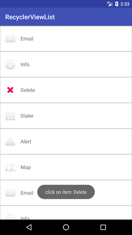

# DAY 12 CHALLENGE
Today’s android challenge is To learn how to use RecyclerView to show a list of items.

## Task requirements
1. On app launch, Activity will appear with RecyclerView filled with a list of items in the hint section.
2. Each of items in the list have icon and a text.
3. When click on item from the list  a message show the clicked item text.

## Hint
- Use icons from android resources, ex: android.R.drawable.ic_dialog_email
- Items list: (email, info, delete, dialer, alert,map)
- Use this list double of times to make a list larger.

## Task screenshot
