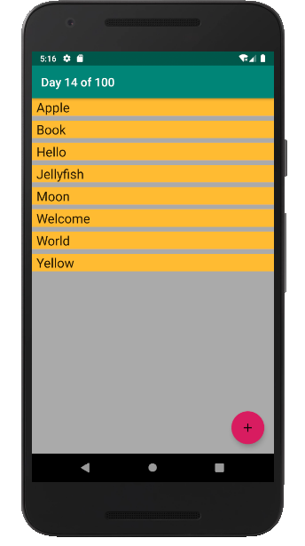
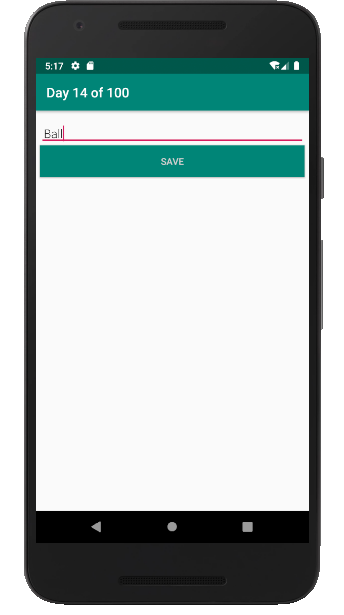

# DAY 14 CHALLENGE
Today’s android challenge is To build an app that uses Android Architecture Components.

The app stores a list of words in a Room database and displays it in a RecyclerView.

The App MainActivity have RecyclerView and FAB when FAB clicked a new activity start to insert the new word, After save the new word will be shown in the RecyclerView.

## Task requirements
1. The app uses Android Architecture Components.
2. App consist of two activities, first activity contain RecyclerView and FloatActionButton.
3. FloatActionButton launches the NewWordActivity, wich contain EditText and Button as screenshots below.
4. Save Button adds the new word in the Room database and get back to the MainActivity.
5. The RecyclerView show all words from the database. 

## Task screenshot
   |   