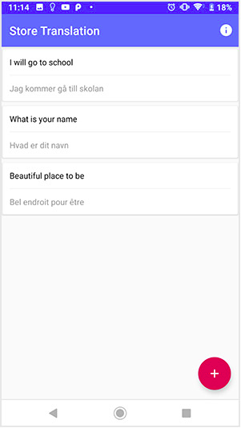
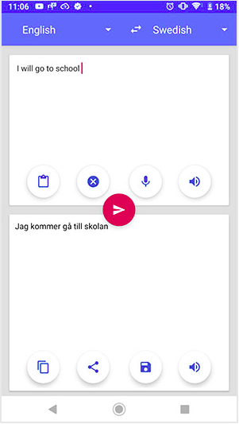

# DAY 15 CHALLENGE
Today’s android challenge is To build a simple android translation application that uses Yandex Translation API to translate from one language to another.

## Task requirements
1. Use Retrofit for Android Network calls.
2. Create two activities as screenshots below, One show saved translations and the second to do translation.
3. Use Room database to save translations.
4. Add tts and voice recognition features.
5. Use swipe to delete translation from the RecyclerView.

## Task screenshot
   |   